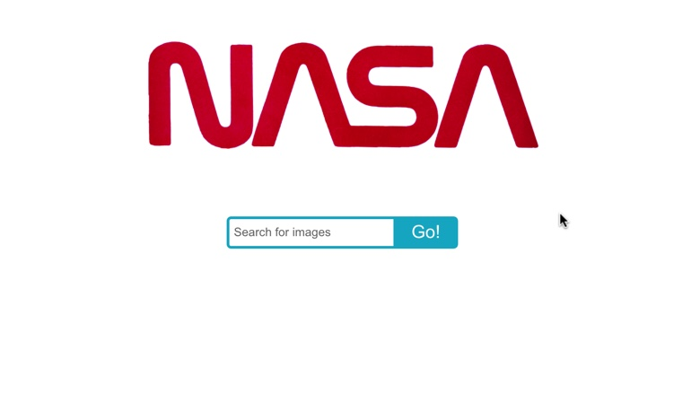
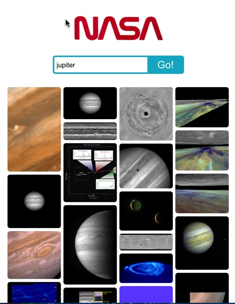

# React Technical Test - NASA image search app

As decribed in our Manchester Codes tech test description, this React app lets users search for images in the NASA image database using space-related queries. We were provided with an API endpoint as part of the brief.

The user can type in a keyword such as 'Jupiter' or 'Venus' to look for related images. When users click the search icon the search results are presented in a grid. If the user enters an invalid search term then they get an an error message which says: "No results".

The app can be displayed correctly both on a mobile and a desktop computer.

The app was tested via Jest and the React Testing Library to make sure it functions correctly.

You can see a live deployed version of the app [by clicking here.](https://react-tech-test-5wtbjoiml-jcainuk.vercel.app)

## Screenshots




## Technologies

- React
- Jest
- React Testing Library
- Third-party NASA API

## Other packages used

- Axios
- PropTypes
- Prettier
- ESLint

## Instructions to run app locally

You can visit the live deployment [by clicking here](https://react-tech-test-5wtbjoiml-jcainuk.vercel.app) or:

1. Clone this repo:

   ```bash
   git clone git@github.com:jcainuk/React-Tech-Test.git
   ```

2. Change directory into the newly created folder and install the project dependencies:

   ```bash
   cd React-Tech-Test
   npm install
   ```

3. Start the React app:

   ```bash
    npm start
   ```

   A browser window should open up with a live version of the app. If this does not happen, navigate to a new browser window and type `http://localhost:3000/` into the address bar

## Additional features for future development

As I had limited time for this project I couldn't implement everything but I have some suggestions as follows:

- Making the individual images clickable and expandable so that they are easier to see
- Allowing users to save favourite images and play a slideshow.
- Making it easier to share images to social media
- Providing more descriptive text for each image

## Contact

Created by [@jcainuk](https://twitter.com/jcainuk)
